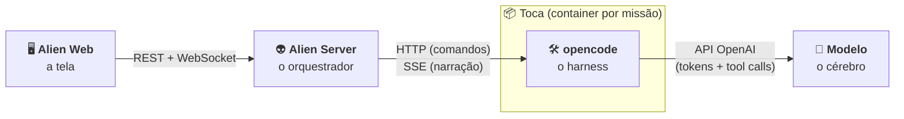

<p align="center">
  
</p>

<h1 align="center">Alien Code</h1>

<p align="center">
  Assistente de codificação <b>local</b>: um agente que trabalha nos seus repositórios dentro de um
  container descartável, com cada passo transmitido ao vivo.
</p>

<p align="center">
  
  
  
  
  
  
</p>

---

## 1. O que é

Você descreve uma tarefa ("corrija a função soma e rode os testes") e aponta um repositório. O Alien Code:

1. sobe a **Toca**, um container Docker isolado, com uma **cópia** do repositório (o original nunca é tocado);
2. coloca o agente **opencode** para trabalhar nela, usando um modelo aberto do **Ollama**;
3. mostra **ao vivo** tudo o que o agente faz: raciocínio, comandos, saída do terminal, diffs e tokens;
4. descarta a Toca no fim.

**Objetivo:** estudar e construir, por marcos, um agente de código no estilo do Manus e do Claude
Code Web, 100% local, seguro (sandbox) e observável (timeline de eventos). É a V2 do estudo iniciado
em `poc-websocket-demo` (assistente) e `coding-agent` (agente codificador).

---

## 2. Visão geral



| Peça | Papel | Em uma frase |
|---|---|---|
| 🖥️ **Alien Web** | **Tela** | Abre missões e mostra a timeline ao vivo. Não decide nada. |
| 👽 **Alien Server** | **Orquestrador** | Decide **o que**, **onde** e **quando**: cria a Toca, manda a tarefa, grava os eventos, controla o status. Nunca fala com o modelo. |
| 🛠️ **opencode** | **Harness** | Decide **como** fazer a tarefa: conversa com o modelo, **executa as tools** (bash, edit…) e narra cada passo. |
| 🧠 **Modelo** | **Cérebro** | Só recebe texto e devolve texto ou um pedido de tool. Não sabe que o resto existe. |

> O modelo **joga**, o opencode **narra** e o Alien Server **anota** cada lance (um `AlienEvent`
> numerado) e repassa ao navegador.

---

## 3. Como rodar

**Pré-requisitos:** Docker (com Compose), Java 21, Maven, Node 20 e git.

```bash
# 1. imagem da Toca (uma vez)
docker build -t alien/toca:0.1 toca/

# 2. Ollama + rede das Tocas (alien-net)
docker compose up -d ollama
docker compose exec ollama ollama pull qwen3:8b
docker compose exec ollama ollama create qwen3-8b-t10 -f /modelfiles/qwen3-8b-t10.Modelfile

# 3. Alien Server → 127.0.0.1:8080
cd alien-server && mvn spring-boot:run

# 4. Alien Web → http://127.0.0.1:5173  (/api e /ws vão para o servidor pelo proxy do Vite)
cd alien-web && npm install && npm run dev
```

Na tela: **Nova missão** → descreva a tarefa e informe o caminho do repositório → **Abrir missão**.

<details>
<summary><b>Configuração</b> (<code>alien-server/src/main/resources/application.yaml</code>)</summary>

| Propriedade | Padrão | Para quê |
|---|---|---|
| `alien.agent.default-model` | `ollama/qwen3-8b-t10` | Modelo usado pelo opencode |
| `alien.agent.base-url` | `http://ollama:11434/v1` | Ollama visto **de dentro da Toca** |
| `alien.agent.request-timeout` | `30m` | Tempo máximo de uma chamada ao modelo |
| `alien.mission.task-timeout` | `45m` | Tempo máximo de uma tarefa |
| `alien.mission.keep-toca` | `false` | Manter a Toca no fim (para depurar) |
| `alien.toca.memory` · `cpus` · `ttl` | `6GB` · `4` · `60m` | Limites da Toca |
| `alien.workspace.allowed-roots` | `~` | Onde os repositórios podem estar |

> **Sem GPU é lento.** Numa CPU de notebook (i7-1255U), o `qwen3:8b` processa ~19 tokens/s e gera
> ~4 tokens/s. Só o system prompt do opencode tem ~7k tokens, e uma tarefa simples levou 16 min.
> Com GPU, ou com um Ollama em outra máquina (`alien.agent.base-url`), o mesmo fluxo roda em segundos.

</details>

<details>
<summary><b>API</b> (REST e WebSocket)</summary>

```bash
curl -s -X POST localhost:8080/api/missions -H 'Content-Type: application/json' -d '{
  "prompt": "A função soma em calc.py está errada. Corrija e rode um teste rápido.",
  "seed": {"type": "existing", "repositories": [{"path": "'$HOME'/projetos/calc"}]}
}'
# → {"id":"m-3f9a1c2e","status":"CREATED",...}

websocat 'ws://127.0.0.1:8080/ws/missions/m-3f9a1c2e?lastSeq=0'    # um envelope JSON por evento
```

| Rota | O que faz |
|---|---|
| `POST /api/missions` | Abre a missão (201) e a conduz em segundo plano |
| `GET /api/missions` · `GET /api/missions/{id}` | Lista / snapshot com `lastSeq` |
| `POST /api/missions/{id}/stop` | Para a missão |
| `WS /ws/missions/{id}?lastSeq=N` | Eventos com seq > N e depois ao vivo; aceita `{"type":"stop"}` |
| `POST /api/tocas` | Cria só uma Toca, sem missão (útil para depurar a semeadura) |
| `GET /api/tocas` · `GET /api/tocas/{id}` · `DELETE /api/tocas/{id}` | Lista / detalha / descarta |

Projeto novo em vez de repositório: `"seed": {"type": "new", "name": "meu-projeto"}`.
A senha do opencode de cada Toca nunca aparece na API.

</details>

<details>
<summary><b>Testes</b></summary>

```bash
cd alien-web    && npm test     # reducer da timeline, reconexão com lastSeq, renderização
cd alien-server && mvn test     # unitários (domínio, casos de uso, adaptadores com git e HTTP reais)
cd alien-server && mvn verify   # + integração com Tocas reais (precisa da imagem e da rede alien-net)
```

O `MissionLifecycleIT` roda missões completas com o **opencode de verdade** numa Toca de verdade,
mas com um LLM roteirizado (`ScriptedLlmServer`) no lugar do Ollama: em segundos e sem GPU.

</details>

---

## 4. Organização do código

O servidor segue **Clean Architecture** com dois domínios. O `core` tem as regras e não conhece
tecnologia; os `adapters` implementam as portas do core (Docker, git, opencode, SQLite, HTTP).

```
alien-code/
├── alien-server/   👽 Java 21 + Spring Boot
├── alien-web/      🖥️ React + TypeScript + Vite
├── toca/           📦 imagem Docker da Toca (JDK, Maven, Node, git, opencode)
├── ollama/         🧠 Modelfile do qwen3-8b-t10
├── docs/           📄 especificação, diagramas de sequência, contrato do opencode
└── compose.yaml    Ollama + rede alien-net
```

### 📦 Domínio `toca`: o ambiente isolado

Cria, semeia, vigia e descarta os containers onde o agente trabalha.

| Camada | Classes | O que é |
|---|---|---|
| `domain/model` | `Toca`, `TocaId`, `TocaStatus`, `TocaEndpoint`, `Seed`, `RepositorySeed` | A Toca, o endereço do opencode nela e o que vai dentro (repos ou projeto novo) |
| `port` | `SandboxPort`, `WorkspaceSnapshotPort`, `AgentHarnessPort`, `TocaRepository` | O que o core precisa: container, cópia dos repos, harness saudável, guardar Tocas |
| `application` | `ProvisionTocaService`, `DisposeTocaService`, `ListTocasService`, `ReapTocasService` | Criar + semear + esperar o opencode; descartar; listar; faxina por TTL |
| `adapters` | `DockerSandboxAdapter`, `GitCloneSnapshotAdapter`, `OpencodeHealthAdapter`, `OpencodeConfigFactory`, `InMemoryTocaRepository`, `TocaJanitor`, `TocaController` | Docker, `git clone --local`, `GET /global/health`, config do opencode, memória, agendador, REST |

### 🎯 Domínio `mission`: a tarefa e a timeline

Conduz uma missão do início ao fim e transforma o que o agente faz em eventos.

| Camada | Classes | O que é |
|---|---|---|
| `domain/model` | `Mission`, `MissionId`, `MissionStatus` | O pedido e **em que pé está** (a foto): `CREATED → PROVISIONING → EXECUTING → COMPLETED / FAILED / CANCELLED` |
| | `AgentModel` | **Qual LLM** (`provedor/modelo`), um valor dentro da missão |
| | `AlienEvent`, `NewEvent`, `EventType`, `EventSource` | **O que aconteceu** (o filme): uma linha numerada (`seq`) da timeline |
| `port` | `AgentSessionPort` + `AgentEvent`, `EventStorePort`, `MissionRepository` | Falar com o harness (neutro, sem formato do opencode); gravar eventos e missões |
| `application` | `MissionConductor` | O **orquestrador**: Toca → sessão → prompt → espera → fim |
| | `TaskTimeline` | `AgentEvent` → linhas da timeline (`NewEvent`) |
| | `MissionEventHub` | Grava no Event Store (ganha `seq`) e entrega a quem assiste, sem buraco nem repetição |
| | `StartMissionService`, `StopMissionService`, `GetMissionService`, `FailInterruptedMissionsService` | Casos de uso |
| `adapters` | `OpencodeSessionAdapter`, `OpencodeEventTranslator` | HTTP + **SSE** com o opencode; JSON do opencode → `AgentEvent` |
| | `MissionWebSocketHandler`, `MissionController` | WebSocket (replay + ao vivo) e REST |
| | `SqliteEventStore`, `SqliteMissionRepository`, `MissionRecovery` | SQLite (`~/.alien-code/alien.db`) e recuperação na subida |

### 🔄 O caminho de um evento

```
modelo → opencode ──SSE──▶ OpencodeSessionAdapter → OpencodeEventTranslator → TaskTimeline
       → MissionEventHub (seq) → SqliteEventStore + MissionWebSocketHandler ──WS──▶ Alien Web
```

### 🖥️ Alien Web (`alien-web/src`)

| Pasta | O que tem |
|---|---|
| `domain/` | Envelope `AlienEvent` e o reducer puro da timeline (eventos → passos) |
| `api/` | REST (`missionsApi`) e `MissionSocket` (reconecta sozinho com `lastSeq`) |
| `hooks/` | `useMissionTimeline` |
| `components/` | `App`, `NewMissionForm`, `MissionList`, `MissionView`, `Timeline`, `TerminalPanel`, `DiffPanel`, `StatusBadge` |

### 📚 Documentação

- [`docs/sequencias.md`](docs/sequencias.md): cada fluxo desenhado classe a classe.
- [`docs/alien-code-especificacao.pdf`](docs/alien-code-especificacao.pdf): a especificação completa.
- [`docs/referencias/opencode-1.18.33-openapi.json`](docs/referencias/opencode-1.18.33-openapi.json): contrato real da API do opencode.

<details>
<summary><b>Mapeamento real dos eventos do opencode</b> (atualiza a seção 8.3 da especificação)</summary>

O OpenAPI do opencode 1.18.33 declara duas gerações de eventos (`message.part.*` e
`session.next.*`), mas o servidor **emite só a primeira**. Conferido gravando o SSE de sessões reais
(`alien-server/src/test/resources/opencode/`).

| SSE do opencode | `AgentEvent` | Evento Alien |
|---|---|---|
| `message.part.delta` de parte `reasoning` | `ReasoningDelta` | `thinking.delta` |
| `message.part.delta` de parte `text` | `TextDelta` | `assistant.delta` |
| `message.part.updated` tool `running` | `ToolStarted` | `tool.started` |
| `message.part.updated` tool `completed` / `error` | `ToolFinished` | `tool.completed` (+ `terminal.output` se `bash`) |
| idem, com `metadata.filediff` | `FileChanged` | `file.changed` |
| `message.part.updated` parte `step-finish` | `ModelCallFinished` | `budget.updated` (acumulado) |
| `session.error` `MessageAbortedError` | `SessionFailed(aborted)` | fim da tarefa por Parar |
| `session.error` (outros) | `SessionFailed` | `step.failed` + missão `FAILED` |
| `session.idle` | `SessionIdle` | `step.completed` |

O `message.part.delta` traz só o id da parte; o tipo vem do `message.part.updated` anterior, por isso
o tradutor guarda o tipo de cada parte.

</details>

<details>
<summary><b>Diferenças conscientes em relação à especificação</b> (M0 e M1)</summary>

- **Rede da Toca:** `alien-net` ainda é uma bridge comum, criada pelo `compose.yaml`. O bloqueio de
  saída chega no M2, com o proxy (uma rede `internal` não permite publicar a porta do opencode).
- **Limite de processos:** 512 em vez de 256; opencode + Node + Maven passam de 256.
- **Persistência:** missões e eventos em SQLite; Tocas em memória. Missões ativas durante um reinício
  viram `FAILED` na subida seguinte.
- **Alterações não commitadas** do repositório original ainda não vão para a Toca.
- **Permissões do agente:** `edit` e `bash` liberados, `webfetch` negado. Cartões de aprovação no M2.
- **Saídas grandes:** `output` e `patch` cortados em 16 mil caracteres (`truncated: true`); blobs no M2.
- **Alien Web:** React 19 e Vitest 4 (a especificação cita React 18).
- **Configuração do opencode:** entregue em `OPENCODE_CONFIG_CONTENT`, gerada de `alien.agent.*`.

</details>

---

## 5. Marcos

| | Marco | O que entrega |
|:-:|---|---|
| ✅ | **M0 · Esqueleto** | Imagem da Toca com opencode; o Alien Server cria, semeia, vigia e destrói Tocas com limites de CPU, memória e processos |
| ✅ | **M1 · Timeline ao vivo** | Missão com 1 repo e 1 tarefa; eventos do opencode → Event Store → WebSocket → UI, com replay por `lastSeq` e botão Parar |
| ⏳ | **M2 · Entrega segura** | Rede bloqueada + proxy de pacotes, aprovações na UI, blobs para saídas grandes |
| ⏳ | **M3 · Grafo** | Grafo de dependências local ([graphify](https://github.com/Graphify-Labs/graphify)) para entender o código e ordenar tarefas |
| ⏳ | **M4 · Multi-repo + DAG** | Várias tarefas e repositórios, executadas em ordem de dependência |
| ⏳ | **M5 · AI-DLC completo** | Fluxo completo com perfis e portões de aprovação ([aidlc-workflows](https://github.com/awslabs/aidlc-workflows)) |
