# Fluxos do código — diagramas de sequência

Cada diagrama segue uma requisição (ou um gatilho interno) pelas classes reais do
`alien-server`, na ordem em que o código executa. Os nomes de participantes são os nomes das
classes; as mensagens são os métodos chamados.

| # | Fluxo | Gatilho |
|---|---|---|
| 0 | [Mapa das camadas](#0-mapa-das-camadas) | — |
| 1 | [Criar Toca com repositórios existentes](#1-criar-toca-com-repositórios-existentes-caminho-feliz) | `POST /api/tocas` (`existing`) |
| 2 | [Dentro do Docker: criar e iniciar o container](#2-dentro-do-docker-criar-e-iniciar-o-container) | detalhe do passo 1 |
| 3 | [Semear o workspace](#3-semear-o-workspace-snapshot--tar--cópia) | detalhe do passo 1 |
| 4 | [Esperar o opencode](#4-esperar-o-opencode-ficar-pronto) | detalhe do passo 1 |
| 5 | [Criar Toca com projeto novo](#5-criar-toca-com-projeto-novo) | `POST /api/tocas` (`new`) |
| 6 | [Falha no provisionamento (rollback)](#6-falha-no-provisionamento-rollback) | erro em qualquer passo |
| 7 | [Pedido inválido](#7-pedido-inválido-400) | `POST /api/tocas` com erro |
| 8 | [Listar e consultar](#8-listar-e-consultar) | `GET /api/tocas[/{id}]` |
| 9 | [Descartar](#9-descartar-uma-toca) | `DELETE /api/tocas/{id}` |
| 10 | [Faxina de Tocas vencidas (TTL)](#10-faxina-de-tocas-vencidas-ttl) | `@Scheduled` |
| 11 | [Remoção de órfãos ao subir](#11-remoção-de-containers-órfãos-ao-subir-o-servidor) | `ApplicationReadyEvent` |
| 12 | [Inicialização dentro da Toca](#12-inicialização-dentro-da-toca) | `docker start` |
| 13 | [Mapa das camadas da missão (M1)](#13-mapa-das-camadas-da-missão-m1) | — |
| 14 | [Abrir uma missão](#14-abrir-uma-missão) | `POST /api/missions` |
| 15 | [Conduzir a missão: Toca, sessão e eventos](#15-conduzir-a-missão-toca-sessão-e-eventos) | `MissionConductor.conduct` |
| 16 | [Timeline ao vivo e reconexão](#16-timeline-ao-vivo-e-reconexão) | `WS /ws/missions/{id}?lastSeq=N` |
| 17 | [Parar a missão](#17-parar-a-missão) | `{"type":"stop"}` ou `POST /api/missions/{id}/stop` |
| 18 | [Erro do agente e tempo esgotado](#18-erro-do-agente-e-tempo-esgotado) | `session.error` / `task-timeout` |
| 19 | [Missões interrompidas por reinício](#19-missões-interrompidas-por-reinício) | `ApplicationReadyEvent` |

## 0. Mapa das camadas

As setas apontam no sentido da dependência: tudo aponta para o **core**, e o core não conhece
Spring MVC, Docker, git ou HTTP.

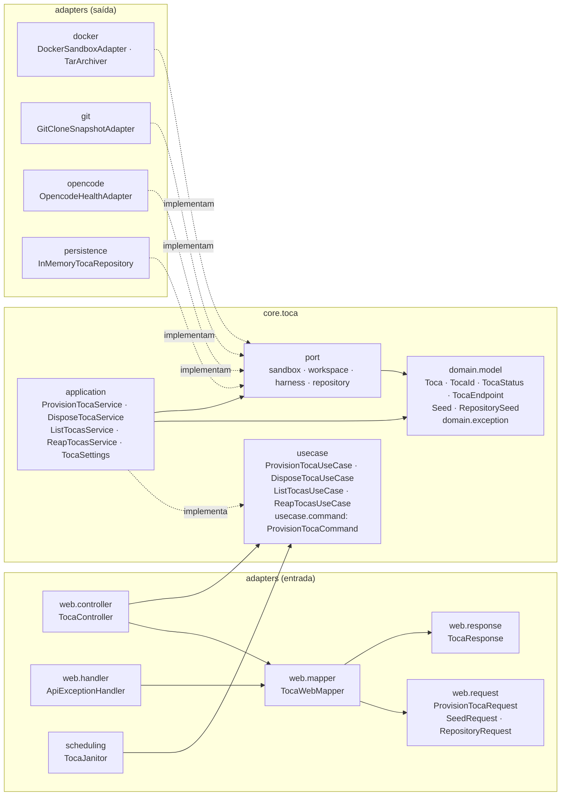
```mermaid
flowchart LR
    subgraph IN["adapters (entrada)"]
        C["web.controller<br/>TocaController"]
        H["web.handler<br/>ApiExceptionHandler"]
        M["web.mapper<br/>TocaWebMapper"]
        RQ["web.request<br/>ProvisionTocaRequest<br/>SeedRequest · RepositoryRequest"]
        RS["web.response<br/>TocaResponse"]
        J["scheduling<br/>TocaJanitor"]
    end

    subgraph CORE["core.toca"]
        UC["usecase<br/>ProvisionTocaUseCase · DisposeTocaUseCase<br/>ListTocasUseCase · ReapTocasUseCase<br/>usecase.command: ProvisionTocaCommand"]
        APP["application<br/>ProvisionTocaService · DisposeTocaService<br/>ListTocasService · ReapTocasService · TocaSettings"]
        DOM["domain.model<br/>Toca · TocaId · TocaStatus · TocaEndpoint<br/>Seed · RepositorySeed<br/>domain.exception"]
        PORT["port<br/>sandbox · workspace · harness · repository"]
    end

    subgraph OUT["adapters (saída)"]
        D["docker<br/>DockerSandboxAdapter · TarArchiver"]
        G["git<br/>GitCloneSnapshotAdapter"]
        O["opencode<br/>OpencodeHealthAdapter"]
        P["persistence<br/>InMemoryTocaRepository"]
    end

    C --> M --> RQ & RS
    C --> UC
    H --> M
    J --> UC
    APP -. implementa .-> UC
    APP --> DOM & PORT
    PORT --> DOM
    D & G & O & P -. implementam .-> PORT
```

| Pacote | Responsabilidade | Regra |
|---|---|---|
| `core.toca.domain.model` | Entidade `Toca`, value objects, `Seed` | Sem framework; transições imutáveis |
| `core.toca.domain.exception` | Erros de negócio | Lançados pelo core, traduzidos na borda |
| `core.toca.port.*` | Interfaces de saída, agrupadas pelo que abstraem, com os seus próprios tipos (`SandboxRequest`, `ExecResult`...) | O core só fala com o mundo por aqui |
| `core.toca.usecase` (+ `.command`) | Interfaces de entrada e os comandos que recebem | O que a aplicação sabe fazer |
| `core.toca.application` | Implementação dos casos de uso | Orquestra domínio e portas |
| `adapters.toca.web.request` / `.response` | DTOs HTTP: só dados, sem lógica | Nunca vazam para o core |
| `adapters.toca.web.mapper` | DTO ⇄ domínio | Único lugar que conhece os dois lados |
| `adapters.toca.web.controller` / `.handler` | Entrada HTTP e tradução de erros | Só traduz e delega |
| `adapters.toca.{docker,git,opencode,persistence}` | Implementações das portas | Toda tecnologia fica aqui |

## 1. Criar Toca com repositórios existentes (caminho feliz)

Visão de ponta a ponta. Os passos em destaque são detalhados nos diagramas 2, 3 e 4.

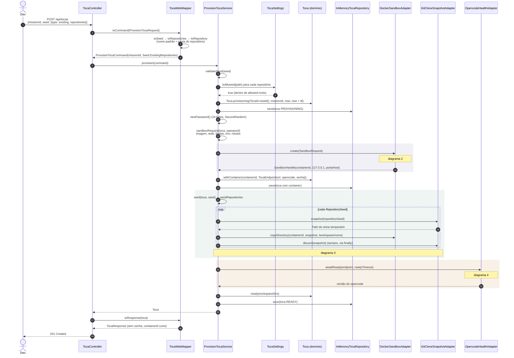
```mermaid
sequenceDiagram
    autonumber
    actor Dev
    participant Ctl as TocaController
    participant Map as TocaWebMapper
    participant Svc as ProvisionTocaService
    participant Set as TocaSettings
    participant Toca as Toca (domínio)
    participant Repo as InMemoryTocaRepository
    participant Sbx as DockerSandboxAdapter
    participant Snap as GitCloneSnapshotAdapter
    participant Hns as OpencodeHealthAdapter

    Dev->>Ctl: POST /api/tocas<br/>{missionId, seed: {type: existing, repositories}}
    Ctl->>Map: toCommand(ProvisionTocaRequest)
    Map->>Map: toSeed → toRepositories → toRepository<br/>(nome padrão = pasta do repositório)
    Map-->>Ctl: ProvisionTocaCommand(missionId, Seed.ExistingRepositories)
    Ctl->>Svc: provision(command)

    Svc->>Svc: validateSeed(seed)
    Svc->>Set: isAllowed(path) para cada repositório
    Set-->>Svc: true (dentro de allowed-roots)

    Svc->>Toca: Toca.provisioning(TocaId.newId(), missionId, now, now + ttl)
    Svc->>Repo: save(toca PROVISIONING)

    Svc->>Svc: newPassword() (24 bytes, SecureRandom)
    Svc->>Svc: sandboxRequest(toca, password)<br/>imagem, rede, limites, env, rótulos
    rect rgba(63, 61, 143, 0.08)
    Svc->>Sbx: create(SandboxRequest)
    Note over Sbx: diagrama 2
    Sbx-->>Svc: SandboxHandle(containerId, 127.0.0.1, portaHost)
    end
    Svc->>Toca: withContainer(containerId, TocaEndpoint(url, opencode, senha))
    Svc->>Repo: save(toca com container)

    rect rgba(47, 133, 90, 0.08)
    Svc->>Svc: seed(toca, seed) → seedRepositories
    loop cada RepositorySeed
        Svc->>Snap: snapshot(repositorySeed)
        Snap-->>Svc: Path do clone temporário
        Svc->>Sbx: copyDirectory(containerId, snapshot, /workspace/nome)
        Svc->>Snap: discard(snapshot) (sempre, via finally)
    end
    Note over Svc,Snap: diagrama 3
    end

    rect rgba(183, 121, 31, 0.10)
    Svc->>Hns: awaitReady(endpoint, readyTimeout)
    Note over Hns: diagrama 4
    Hns-->>Svc: versão do opencode
    end

    Svc->>Toca: ready(workspaceDirs)
    Svc->>Repo: save(toca READY)
    Svc-->>Ctl: Toca
    Ctl->>Map: toResponse(toca)
    Map-->>Ctl: TocaResponse (sem senha, containerId curto)
    Ctl-->>Dev: 201 Created
```

## 2. Dentro do Docker: criar e iniciar o container

`DockerSandboxAdapter.create` — tudo pela API do Docker Engine (docker-java), sem a CLI.

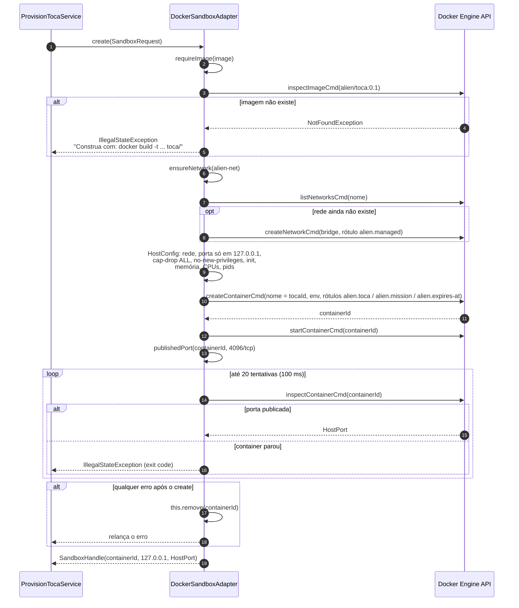
```mermaid
sequenceDiagram
    autonumber
    participant Svc as ProvisionTocaService
    participant Sbx as DockerSandboxAdapter
    participant Dk as Docker Engine API

    Svc->>Sbx: create(SandboxRequest)
    Sbx->>Sbx: requireImage(image)
    Sbx->>Dk: inspectImageCmd(alien/toca:0.1)
    alt imagem não existe
        Dk-->>Sbx: NotFoundException
        Sbx-->>Svc: IllegalStateException<br/>"Construa com: docker build -t ... toca/"
    end
    Sbx->>Sbx: ensureNetwork(alien-net)
    Sbx->>Dk: listNetworksCmd(nome)
    opt rede ainda não existe
        Sbx->>Dk: createNetworkCmd(bridge, rótulo alien.managed)
    end
    Sbx->>Sbx: HostConfig: rede, porta só em 127.0.0.1,<br/>cap-drop ALL, no-new-privileges, init,<br/>memória, CPUs, pids
    Sbx->>Dk: createContainerCmd(nome = tocaId, env, rótulos alien.toca / alien.mission / alien.expires-at)
    Dk-->>Sbx: containerId
    Sbx->>Dk: startContainerCmd(containerId)
    Sbx->>Sbx: publishedPort(containerId, 4096/tcp)
    loop até 20 tentativas (100 ms)
        Sbx->>Dk: inspectContainerCmd(containerId)
        alt porta publicada
            Dk-->>Sbx: HostPort
        else container parou
            Sbx-->>Svc: IllegalStateException (exit code)
        end
    end
    alt qualquer erro após o create
        Sbx->>Sbx: this.remove(containerId)
        Sbx-->>Svc: relança o erro
    end
    Sbx-->>Svc: SandboxHandle(containerId, 127.0.0.1, HostPort)
```

## 3. Semear o workspace (snapshot → tar → cópia)

O repositório original nunca é montado na Toca: é clonado para uma pasta temporária, empacotado
e copiado, e o clone temporário é apagado.

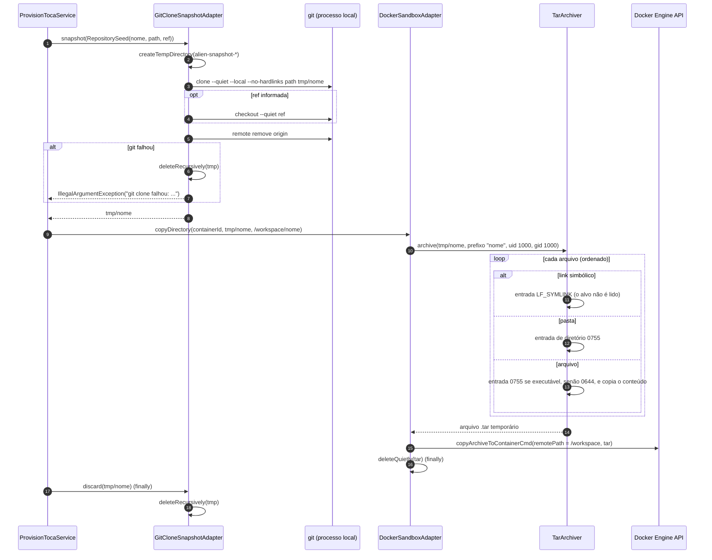
```mermaid
sequenceDiagram
    autonumber
    participant Svc as ProvisionTocaService
    participant Snap as GitCloneSnapshotAdapter
    participant Git as git (processo local)
    participant Sbx as DockerSandboxAdapter
    participant Tar as TarArchiver
    participant Dk as Docker Engine API

    Svc->>Snap: snapshot(RepositorySeed(nome, path, ref))
    Snap->>Snap: createTempDirectory(alien-snapshot-*)
    Snap->>Git: clone --quiet --local --no-hardlinks path tmp/nome
    opt ref informada
        Snap->>Git: checkout --quiet ref
    end
    Snap->>Git: remote remove origin
    alt git falhou
        Snap->>Snap: deleteRecursively(tmp)
        Snap-->>Svc: IllegalArgumentException("git clone falhou: ...")
    end
    Snap-->>Svc: tmp/nome

    Svc->>Sbx: copyDirectory(containerId, tmp/nome, /workspace/nome)
    Sbx->>Tar: archive(tmp/nome, prefixo "nome", uid 1000, gid 1000)
    loop cada arquivo (ordenado)
        alt link simbólico
            Tar->>Tar: entrada LF_SYMLINK (o alvo não é lido)
        else pasta
            Tar->>Tar: entrada de diretório 0755
        else arquivo
            Tar->>Tar: entrada 0755 se executável, senão 0644, e copia o conteúdo
        end
    end
    Tar-->>Sbx: arquivo .tar temporário
    Sbx->>Dk: copyArchiveToContainerCmd(remotePath = /workspace, tar)
    Sbx->>Sbx: deleteQuietly(tar) (finally)

    Svc->>Snap: discard(tmp/nome) (finally)
    Snap->>Snap: deleteRecursively(tmp)
```

## 4. Esperar o opencode ficar pronto

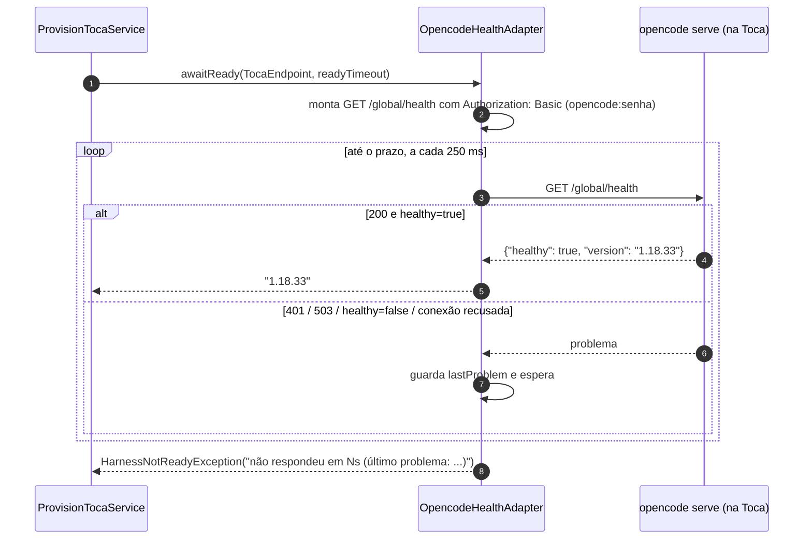
```mermaid
sequenceDiagram
    autonumber
    participant Svc as ProvisionTocaService
    participant Hns as OpencodeHealthAdapter
    participant Oc as opencode serve (na Toca)

    Svc->>Hns: awaitReady(TocaEndpoint, readyTimeout)
    Hns->>Hns: monta GET /global/health com Authorization: Basic (opencode:senha)
    loop até o prazo, a cada 250 ms
        Hns->>Oc: GET /global/health
        alt 200 e healthy=true
            Oc-->>Hns: {"healthy": true, "version": "1.18.33"}
            Hns-->>Svc: "1.18.33"
        else 401 / 503 / healthy=false / conexão recusada
            Oc-->>Hns: problema
            Hns->>Hns: guarda lastProblem e espera
        end
    end
    Hns-->>Svc: HarnessNotReadyException("não respondeu em Ns (último problema: ...)")
```

## 5. Criar Toca com projeto novo

Mesmo fluxo do diagrama 1 até o container existir; a semeadura é um `git init` dentro da Toca.

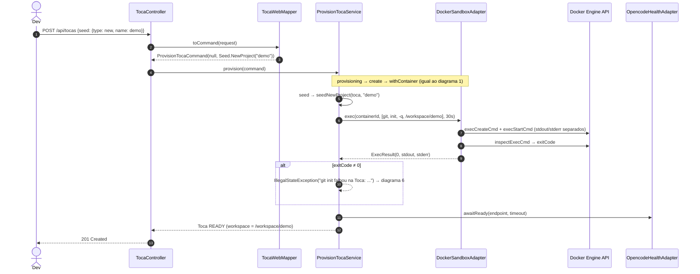
```mermaid
sequenceDiagram
    autonumber
    actor Dev
    participant Ctl as TocaController
    participant Map as TocaWebMapper
    participant Svc as ProvisionTocaService
    participant Sbx as DockerSandboxAdapter
    participant Dk as Docker Engine API
    participant Hns as OpencodeHealthAdapter

    Dev->>Ctl: POST /api/tocas {seed: {type: new, name: demo}}
    Ctl->>Map: toCommand(request)
    Map-->>Ctl: ProvisionTocaCommand(null, Seed.NewProject("demo"))
    Ctl->>Svc: provision(command)
    Note over Svc,Sbx: provisioning → create → withContainer (igual ao diagrama 1)
    Svc->>Svc: seed → seedNewProject(toca, "demo")
    Svc->>Sbx: exec(containerId, [git, init, -q, /workspace/demo], 30s)
    Sbx->>Dk: execCreateCmd + execStartCmd (stdout/stderr separados)
    Sbx->>Dk: inspectExecCmd → exitCode
    Sbx-->>Svc: ExecResult(0, stdout, stderr)
    alt exitCode ≠ 0
        Svc-->>Svc: IllegalStateException("git init falhou na Toca: ...") → diagrama 6
    end
    Svc->>Hns: awaitReady(endpoint, timeout)
    Svc-->>Ctl: Toca READY (workspace = /workspace/demo)
    Ctl-->>Dev: 201 Created
```

## 6. Falha no provisionamento (rollback)

Qualquer `RuntimeException` depois de a Toca ser registrada cai no mesmo `catch`: o container é
removido na hora e a Toca fica registrada como `FAILED` para diagnóstico.

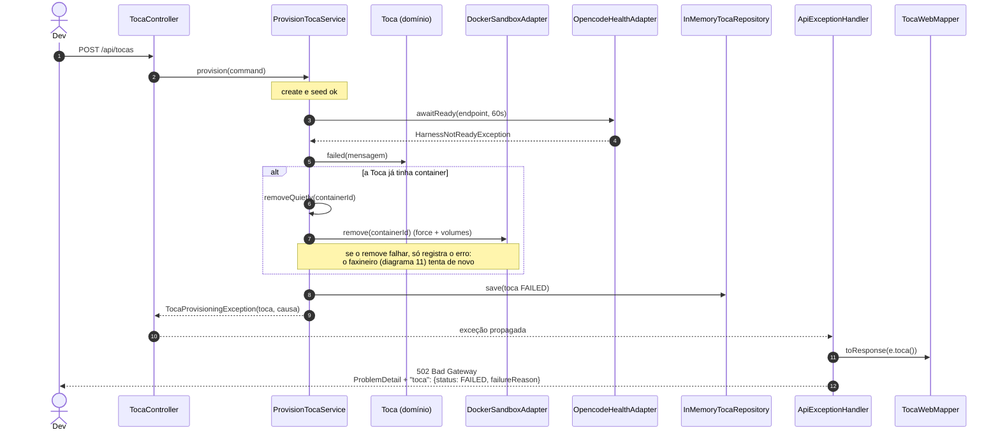
```mermaid
sequenceDiagram
    autonumber
    actor Dev
    participant Ctl as TocaController
    participant Svc as ProvisionTocaService
    participant Toca as Toca (domínio)
    participant Sbx as DockerSandboxAdapter
    participant Hns as OpencodeHealthAdapter
    participant Repo as InMemoryTocaRepository
    participant Hdl as ApiExceptionHandler
    participant Map as TocaWebMapper

    Dev->>Ctl: POST /api/tocas
    Ctl->>Svc: provision(command)
    Note over Svc: create e seed ok
    Svc->>Hns: awaitReady(endpoint, 60s)
    Hns-->>Svc: HarnessNotReadyException
    Svc->>Toca: failed(mensagem)
    alt a Toca já tinha container
        Svc->>Svc: removeQuietly(containerId)
        Svc->>Sbx: remove(containerId) (force + volumes)
        Note over Svc,Sbx: se o remove falhar, só registra o erro:<br/>o faxineiro (diagrama 11) tenta de novo
    end
    Svc->>Repo: save(toca FAILED)
    Svc-->>Ctl: TocaProvisioningException(toca, causa)
    Ctl-->>Hdl: exceção propagada
    Hdl->>Map: toResponse(e.toca())
    Hdl-->>Dev: 502 Bad Gateway<br/>ProblemDetail + "toca": {status: FAILED, failureReason}
```

## 7. Pedido inválido (400)

A validação acontece em camadas: o mapper recusa o **formato**, o domínio recusa **valores**
inválidos e o serviço recusa o que fere a **política** (pastas permitidas) — sempre antes de
qualquer container existir.

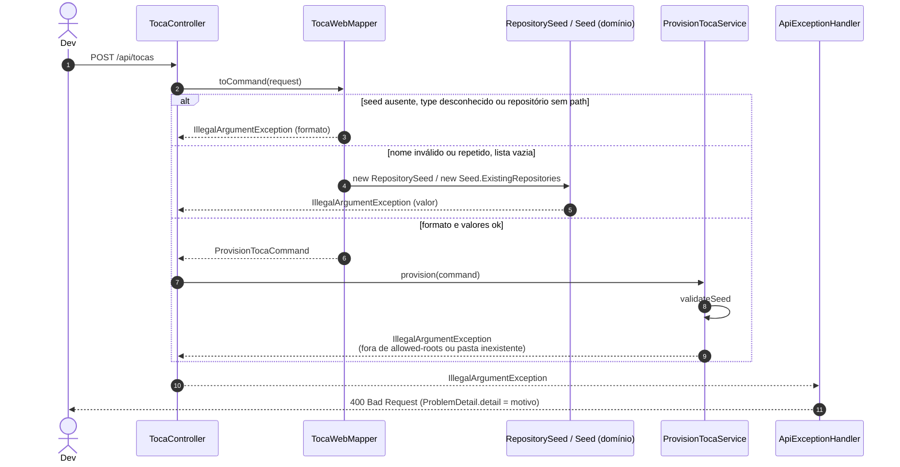
```mermaid
sequenceDiagram
    autonumber
    actor Dev
    participant Ctl as TocaController
    participant Map as TocaWebMapper
    participant Dom as RepositorySeed / Seed (domínio)
    participant Svc as ProvisionTocaService
    participant Hdl as ApiExceptionHandler

    Dev->>Ctl: POST /api/tocas
    Ctl->>Map: toCommand(request)
    alt seed ausente, type desconhecido ou repositório sem path
        Map-->>Ctl: IllegalArgumentException (formato)
    else nome inválido ou repetido, lista vazia
        Map->>Dom: new RepositorySeed / new Seed.ExistingRepositories
        Dom-->>Ctl: IllegalArgumentException (valor)
    else formato e valores ok
        Map-->>Ctl: ProvisionTocaCommand
        Ctl->>Svc: provision(command)
        Svc->>Svc: validateSeed
        Svc-->>Ctl: IllegalArgumentException<br/>(fora de allowed-roots ou pasta inexistente)
    end
    Ctl-->>Hdl: IllegalArgumentException
    Hdl-->>Dev: 400 Bad Request (ProblemDetail.detail = motivo)
```

## 8. Listar e consultar

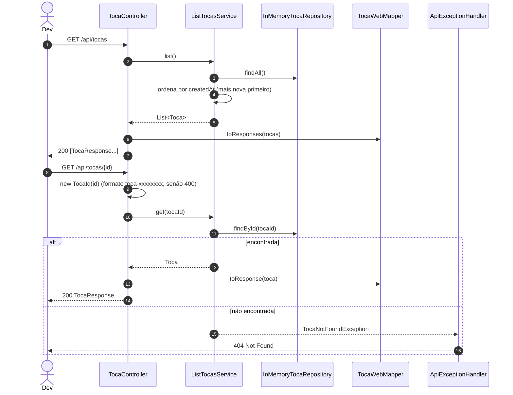
```mermaid
sequenceDiagram
    autonumber
    actor Dev
    participant Ctl as TocaController
    participant Svc as ListTocasService
    participant Repo as InMemoryTocaRepository
    participant Map as TocaWebMapper
    participant Hdl as ApiExceptionHandler

    Dev->>Ctl: GET /api/tocas
    Ctl->>Svc: list()
    Svc->>Repo: findAll()
    Svc->>Svc: ordena por createdAt (mais nova primeiro)
    Svc-->>Ctl: List<Toca>
    Ctl->>Map: toResponses(tocas)
    Ctl-->>Dev: 200 [TocaResponse...]

    Dev->>Ctl: GET /api/tocas/{id}
    Ctl->>Ctl: new TocaId(id) (formato toca-xxxxxxxx, senão 400)
    Ctl->>Svc: get(tocaId)
    Svc->>Repo: findById(tocaId)
    alt encontrada
        Svc-->>Ctl: Toca
        Ctl->>Map: toResponse(toca)
        Ctl-->>Dev: 200 TocaResponse
    else não encontrada
        Svc-->>Hdl: TocaNotFoundException
        Hdl-->>Dev: 404 Not Found
    end
```

## 9. Descartar uma Toca

Idempotente: descartar de novo (ou descartar uma Toca `FAILED`) não toca no Docker.

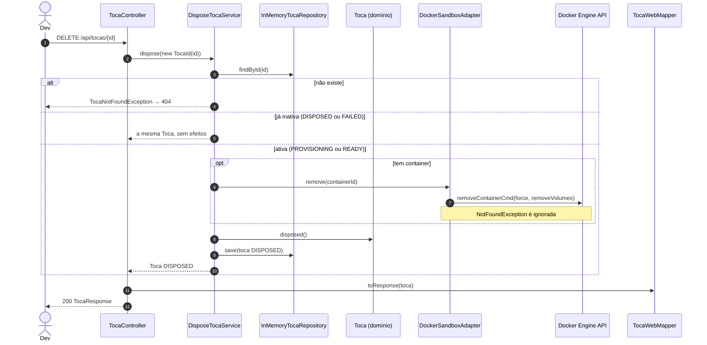
```mermaid
sequenceDiagram
    autonumber
    actor Dev
    participant Ctl as TocaController
    participant Svc as DisposeTocaService
    participant Repo as InMemoryTocaRepository
    participant Toca as Toca (domínio)
    participant Sbx as DockerSandboxAdapter
    participant Dk as Docker Engine API
    participant Map as TocaWebMapper

    Dev->>Ctl: DELETE /api/tocas/{id}
    Ctl->>Svc: dispose(new TocaId(id))
    Svc->>Repo: findById(id)
    alt não existe
        Svc-->>Dev: TocaNotFoundException → 404
    else já inativa (DISPOSED ou FAILED)
        Svc-->>Ctl: a mesma Toca, sem efeitos
    else ativa (PROVISIONING ou READY)
        opt tem container
            Svc->>Sbx: remove(containerId)
            Sbx->>Dk: removeContainerCmd(force, removeVolumes)
            Note over Sbx,Dk: NotFoundException é ignorada
        end
        Svc->>Toca: disposed()
        Svc->>Repo: save(toca DISPOSED)
        Svc-->>Ctl: Toca DISPOSED
    end
    Ctl->>Map: toResponse(toca)
    Ctl-->>Dev: 200 TocaResponse
```

## 10. Faxina de Tocas vencidas (TTL)

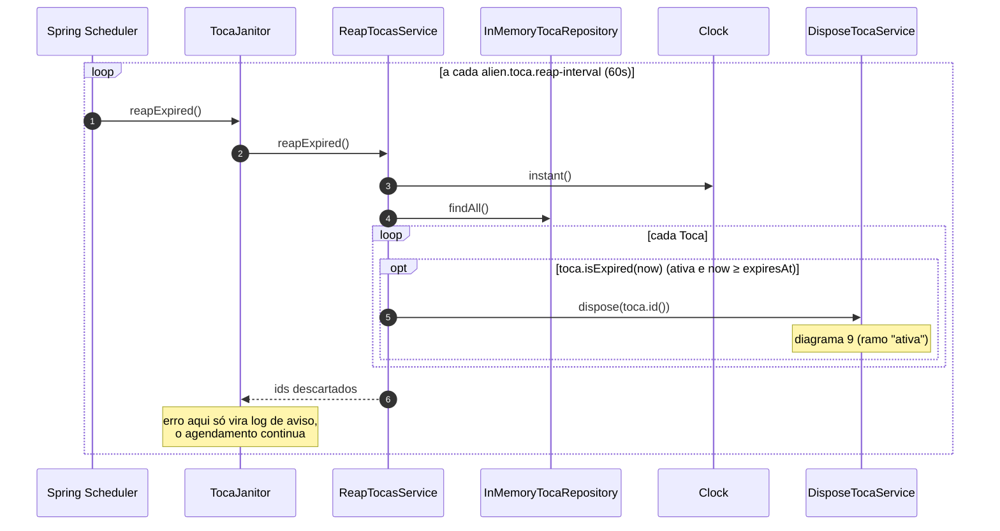
```mermaid
sequenceDiagram
    autonumber
    participant Sch as Spring Scheduler
    participant Jan as TocaJanitor
    participant Reap as ReapTocasService
    participant Repo as InMemoryTocaRepository
    participant Clock as Clock
    participant Disp as DisposeTocaService

    loop a cada alien.toca.reap-interval (60s)
        Sch->>Jan: reapExpired()
        Jan->>Reap: reapExpired()
        Reap->>Clock: instant()
        Reap->>Repo: findAll()
        loop cada Toca
            opt toca.isExpired(now) (ativa e now ≥ expiresAt)
                Reap->>Disp: dispose(toca.id())
                Note over Disp: diagrama 9 (ramo "ativa")
            end
        end
        Reap-->>Jan: ids descartados
        Note over Jan: erro aqui só vira log de aviso,<br/>o agendamento continua
    end
```

## 11. Remoção de containers órfãos ao subir o servidor

As Tocas ficam em memória: se o servidor cair, os containers continuam rodando sem dono. Na
próxima subida eles são encontrados pelo rótulo `alien.toca` e removidos.

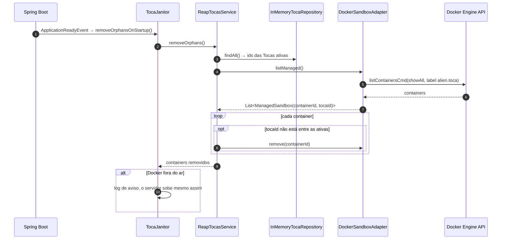
```mermaid
sequenceDiagram
    autonumber
    participant Boot as Spring Boot
    participant Jan as TocaJanitor
    participant Reap as ReapTocasService
    participant Repo as InMemoryTocaRepository
    participant Sbx as DockerSandboxAdapter
    participant Dk as Docker Engine API

    Boot->>Jan: ApplicationReadyEvent → removeOrphansOnStartup()
    Jan->>Reap: removeOrphans()
    Reap->>Repo: findAll() → ids das Tocas ativas
    Reap->>Sbx: listManaged()
    Sbx->>Dk: listContainersCmd(showAll, label alien.toca)
    Dk-->>Sbx: containers
    Sbx-->>Reap: List<ManagedSandbox(containerId, tocaId)>
    loop cada container
        opt tocaId não está entre as ativas
            Reap->>Sbx: remove(containerId)
        end
    end
    Reap-->>Jan: containers removidos
    alt Docker fora do ar
        Jan->>Jan: log de aviso, o servidor sobe mesmo assim
    end
```

## 12. Inicialização dentro da Toca

O que acontece no container entre o `startContainerCmd` (diagrama 2) e o primeiro `200` do
health (diagrama 4).

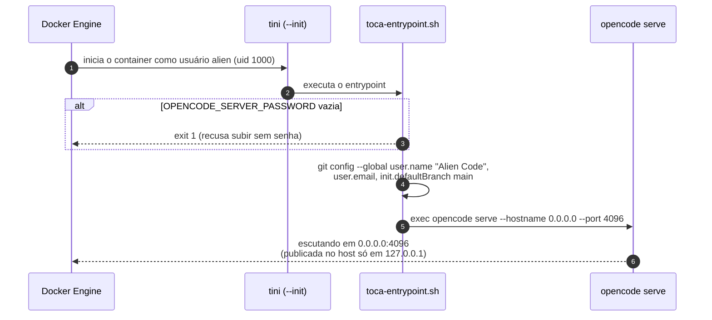
```mermaid
sequenceDiagram
    autonumber
    participant Dk as Docker Engine
    participant Init as tini (--init)
    participant Ep as toca-entrypoint.sh
    participant Oc as opencode serve

    Dk->>Init: inicia o container como usuário alien (uid 1000)
    Init->>Ep: executa o entrypoint
    alt OPENCODE_SERVER_PASSWORD vazia
        Ep-->>Dk: exit 1 (recusa subir sem senha)
    end
    Ep->>Ep: git config --global user.name "Alien Code",<br/>user.email, init.defaultBranch main
    Ep->>Oc: exec opencode serve --hostname 0.0.0.0 --port 4096
    Oc-->>Dk: escutando em 0.0.0.0:4096<br/>(publicada no host só em 127.0.0.1)
```

## 13. Mapa das camadas da missão (M1)

A missão é um contexto próprio (`core.mission` / `adapters.mission`). Ela usa a Toca pelos casos
de uso do contexto `toca` (`ProvisionTocaUseCase`, `DisposeTocaUseCase`), nunca pelas portas dele.

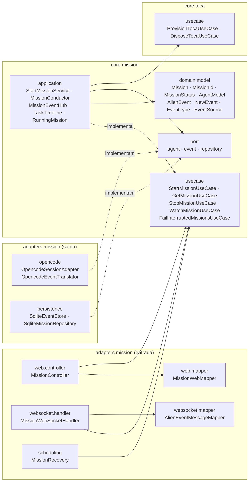
```mermaid
flowchart LR
    subgraph IN["adapters.mission (entrada)"]
        C["web.controller<br/>MissionController"]
        M["web.mapper<br/>MissionWebMapper"]
        W["websocket.handler<br/>MissionWebSocketHandler"]
        WM["websocket.mapper<br/>AlienEventMessageMapper"]
        R["scheduling<br/>MissionRecovery"]
    end

    subgraph CORE["core.mission"]
        UC["usecase<br/>StartMissionUseCase · GetMissionUseCase<br/>StopMissionUseCase · WatchMissionUseCase<br/>FailInterruptedMissionsUseCase"]
        APP["application<br/>StartMissionService · MissionConductor<br/>MissionEventHub · TaskTimeline · RunningMission"]
        DOM["domain.model<br/>Mission · MissionId · MissionStatus · AgentModel<br/>AlienEvent · NewEvent · EventType · EventSource"]
        PORT["port<br/>agent · event · repository"]
    end

    subgraph TOCA["core.toca"]
        TUC["usecase<br/>ProvisionTocaUseCase · DisposeTocaUseCase"]
    end

    subgraph OUT["adapters.mission (saída)"]
        O["opencode<br/>OpencodeSessionAdapter<br/>OpencodeEventTranslator"]
        P["persistence<br/>SqliteEventStore · SqliteMissionRepository"]
    end

    C --> M
    C & W & R --> UC
    W --> WM
    APP -. implementa .-> UC
    APP --> DOM & PORT & TUC
    O & P -. implementam .-> PORT
```

## 14. Abrir uma missão

`POST /api/missions` responde na hora, com a missão em `CREATED`. O trabalho segue em segundo
plano num thread virtual (diagrama 15).

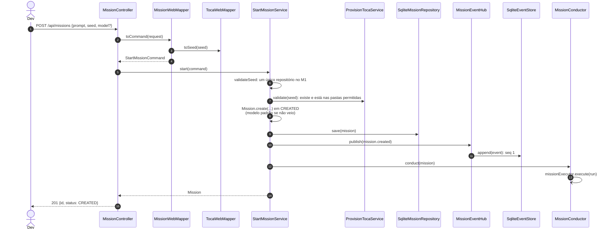
```mermaid
sequenceDiagram
    autonumber
    actor Dev
    participant Ctl as MissionController
    participant Map as MissionWebMapper
    participant TMap as TocaWebMapper
    participant Svc as StartMissionService
    participant Prov as ProvisionTocaService
    participant Repo as SqliteMissionRepository
    participant Hub as MissionEventHub
    participant Store as SqliteEventStore
    participant Cond as MissionConductor

    Dev->>Ctl: POST /api/missions {prompt, seed, model?}
    Ctl->>Map: toCommand(request)
    Map->>TMap: toSeed(seed)
    Map-->>Ctl: StartMissionCommand
    Ctl->>Svc: start(command)
    Svc->>Svc: validateSeed: um único repositório no M1
    Svc->>Prov: validate(seed): existe e está nas pastas permitidas
    Svc->>Svc: Mission.create(...) em CREATED<br/>(modelo padrão se não veio)
    Svc->>Repo: save(mission)
    Svc->>Hub: publish(mission.created)
    Hub->>Store: append(event): seq 1
    Svc->>Cond: conduct(mission)
    Cond-)Cond: missionExecutor.execute(run)
    Svc-->>Ctl: Mission
    Ctl-->>Dev: 201 {id, status: CREATED}
```

## 15. Conduzir a missão: Toca, sessão e eventos

O orquestrador decide cada transição; o modelo só produz eventos. Cada evento do opencode passa
por dois tradutores: `OpencodeEventTranslator` (formato do opencode → `AgentEvent`, neutro) e
`TaskTimeline` (`AgentEvent` → linhas da timeline, com `stepId` e `parentStepId`).

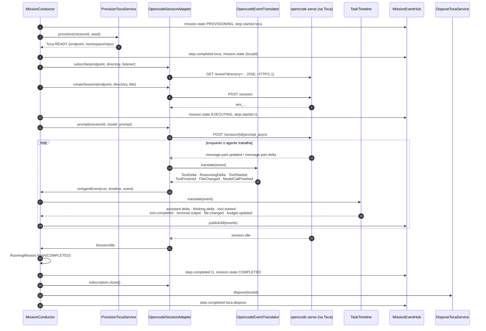
```mermaid
sequenceDiagram
    autonumber
    participant Cond as MissionConductor
    participant Prov as ProvisionTocaService
    participant Ag as OpencodeSessionAdapter
    participant Tr as OpencodeEventTranslator
    participant Oc as opencode serve (na Toca)
    participant TL as TaskTimeline
    participant Hub as MissionEventHub
    participant Disp as DisposeTocaService

    Cond->>Hub: mission.state PROVISIONING, step.started toca
    Cond->>Prov: provision(missionId, seed)
    Prov-->>Cond: Toca READY (endpoint, /workspace/repo)
    Cond->>Hub: step.completed toca, mission.state (tocaId)
    Cond->>Ag: subscribe(endpoint, directory, listener)
    Ag->>Oc: GET /event?directory=... (SSE, HTTP/1.1)
    Cond->>Ag: createSession(endpoint, directory, title)
    Ag->>Oc: POST /session
    Oc-->>Ag: ses_...
    Cond->>Hub: mission.state EXECUTING, step.started t1
    Cond->>Ag: prompt(sessionId, model, prompt)
    Ag->>Oc: POST /session/{id}/prompt_async
    loop enquanto o agente trabalha
        Oc--)Ag: message.part.updated / message.part.delta
        Ag->>Tr: translate(event)
        Tr-->>Ag: TextDelta · ReasoningDelta · ToolStarted<br/>ToolFinished · FileChanged · ModelCallFinished
        Ag->>Cond: onAgentEvent(run, timeline, event)
        Cond->>TL: translate(event)
        TL-->>Cond: assistant.delta · thinking.delta · tool.started<br/>tool.completed · terminal.output · file.changed · budget.updated
        Cond->>Hub: publishAll(events)
    end
    Oc--)Ag: session.idle
    Ag->>Cond: SessionIdle
    Cond->>Cond: RunningMission.finish(COMPLETED)
    Cond->>Hub: step.completed t1, mission.state COMPLETED
    Cond->>Ag: subscription.close()
    Cond->>Disp: dispose(tocaId)
    Cond->>Hub: step.completed toca.dispose
```

## 16. Timeline ao vivo e reconexão

Gravar + distribuir e reproduzir + registrar acontecem sob o mesmo lock por missão: quem conecta
no meio da execução recebe o histórico e depois o ao vivo, sem buraco nem repetição.

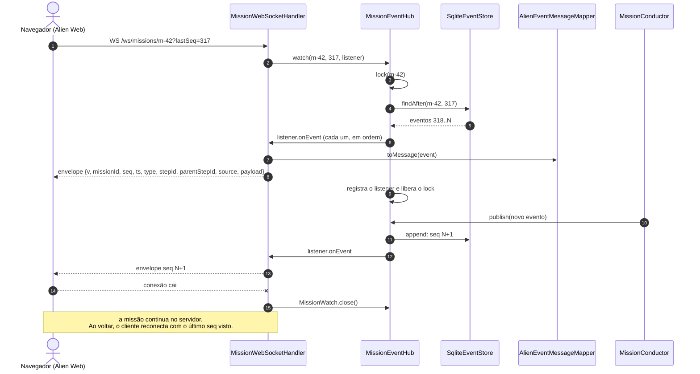
```mermaid
sequenceDiagram
    autonumber
    actor Web as Navegador (Alien Web)
    participant Ws as MissionWebSocketHandler
    participant Hub as MissionEventHub
    participant Store as SqliteEventStore
    participant WMap as AlienEventMessageMapper
    participant Cond as MissionConductor

    Web->>Ws: WS /ws/missions/m-42?lastSeq=317
    Ws->>Hub: watch(m-42, 317, listener)
    Hub->>Hub: lock(m-42)
    Hub->>Store: findAfter(m-42, 317)
    Store-->>Hub: eventos 318..N
    Hub->>Ws: listener.onEvent (cada um, em ordem)
    Ws->>WMap: toMessage(event)
    Ws-->>Web: envelope {v, missionId, seq, ts, type, stepId, parentStepId, source, payload}
    Hub->>Hub: registra o listener e libera o lock
    Cond->>Hub: publish(novo evento)
    Hub->>Store: append: seq N+1
    Hub->>Ws: listener.onEvent
    Ws-->>Web: envelope seq N+1
    Web--xWs: conexão cai
    Ws->>Hub: MissionWatch.close()
    Note over Web,Ws: a missão continua no servidor.<br/>Ao voltar, o cliente reconecta com o último seq visto.
```

## 17. Parar a missão

A parada pode chegar antes da sessão existir (durante o provisionamento): `RunningMission`
guarda o pedido, e o orquestrador aborta assim que a sessão é criada, ou nem cria.

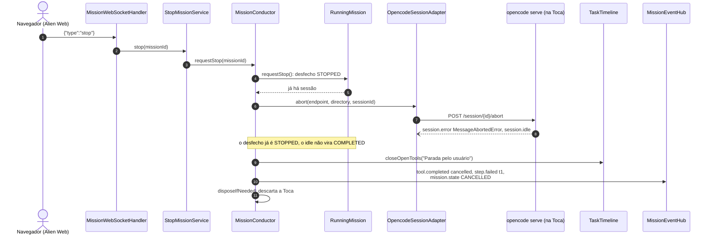
```mermaid
sequenceDiagram
    autonumber
    actor Web as Navegador (Alien Web)
    participant Ws as MissionWebSocketHandler
    participant Stop as StopMissionService
    participant Cond as MissionConductor
    participant Run as RunningMission
    participant Ag as OpencodeSessionAdapter
    participant Oc as opencode serve (na Toca)
    participant TL as TaskTimeline
    participant Hub as MissionEventHub

    Web->>Ws: {"type":"stop"}
    Ws->>Stop: stop(missionId)
    Stop->>Cond: requestStop(missionId)
    Cond->>Run: requestStop(): desfecho STOPPED
    Run-->>Cond: já há sessão
    Cond->>Ag: abort(endpoint, directory, sessionId)
    Ag->>Oc: POST /session/{id}/abort
    Oc--)Ag: session.error MessageAbortedError, session.idle
    Note over Cond,Run: o desfecho já é STOPPED, o idle não vira COMPLETED
    Cond->>TL: closeOpenTools("Parada pelo usuário")
    Cond->>Hub: tool.completed cancelled, step.failed t1,<br/>mission.state CANCELLED
    Cond->>Cond: disposeIfNeeded: descarta a Toca
```

## 18. Erro do agente e tempo esgotado

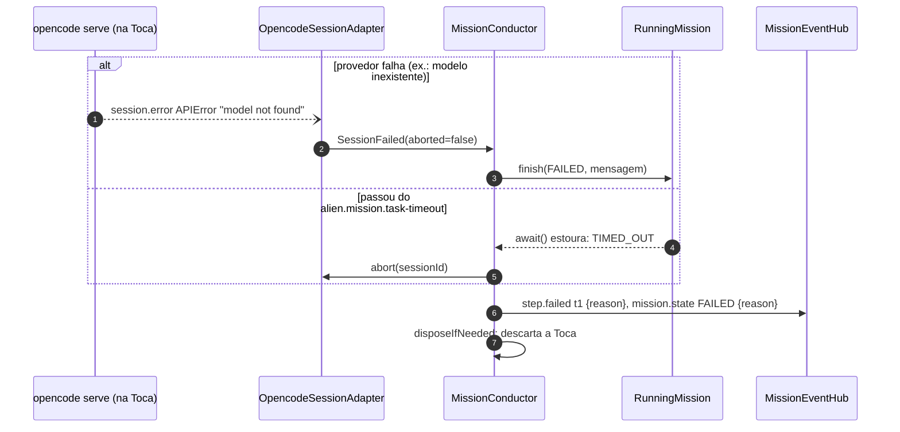
```mermaid
sequenceDiagram
    autonumber
    participant Oc as opencode serve (na Toca)
    participant Ag as OpencodeSessionAdapter
    participant Cond as MissionConductor
    participant Run as RunningMission
    participant Hub as MissionEventHub

    alt provedor falha (ex.: modelo inexistente)
        Oc--)Ag: session.error APIError "model not found"
        Ag->>Cond: SessionFailed(aborted=false)
        Cond->>Run: finish(FAILED, mensagem)
    else passou do alien.mission.task-timeout
        Run-->>Cond: await() estoura: TIMED_OUT
        Cond->>Ag: abort(sessionId)
    end
    Cond->>Hub: step.failed t1 {reason}, mission.state FAILED {reason}
    Cond->>Cond: disposeIfNeeded: descarta a Toca
```

## 19. Missões interrompidas por reinício

As missões e os eventos ficam no SQLite (`alien.mission.store-path`), mas quem conduzia a missão
morreu com o processo, e a Toca dela vira órfã (diagrama 11).

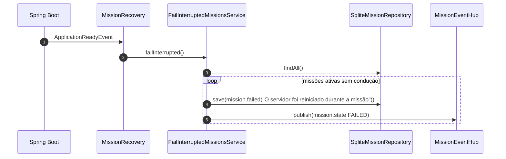
```mermaid
sequenceDiagram
    autonumber
    participant Boot as Spring Boot
    participant Rec as MissionRecovery
    participant Svc as FailInterruptedMissionsService
    participant Repo as SqliteMissionRepository
    participant Hub as MissionEventHub

    Boot->>Rec: ApplicationReadyEvent
    Rec->>Svc: failInterrupted()
    Svc->>Repo: findAll()
    loop missões ativas sem condução
        Svc->>Repo: save(mission.failed("O servidor foi reiniciado durante a missão"))
        Svc->>Hub: publish(mission.state FAILED)
    end
```
